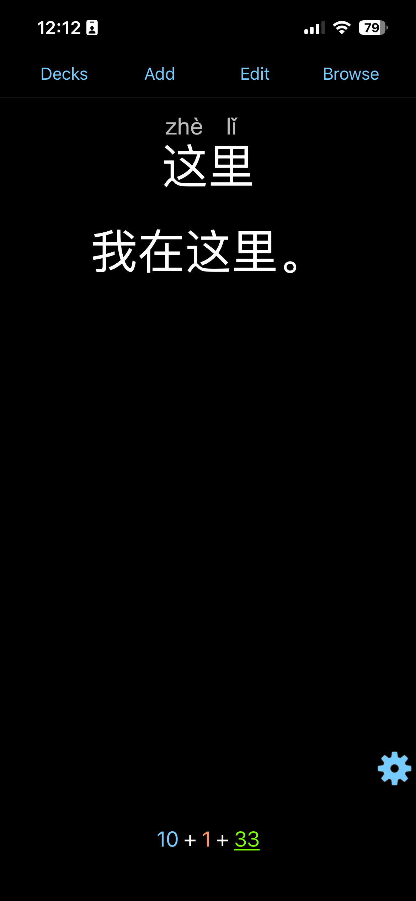
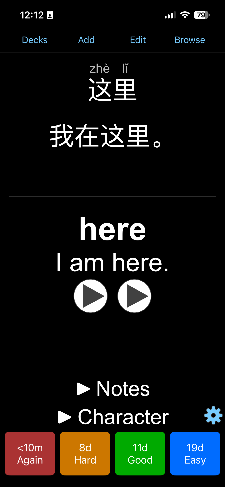
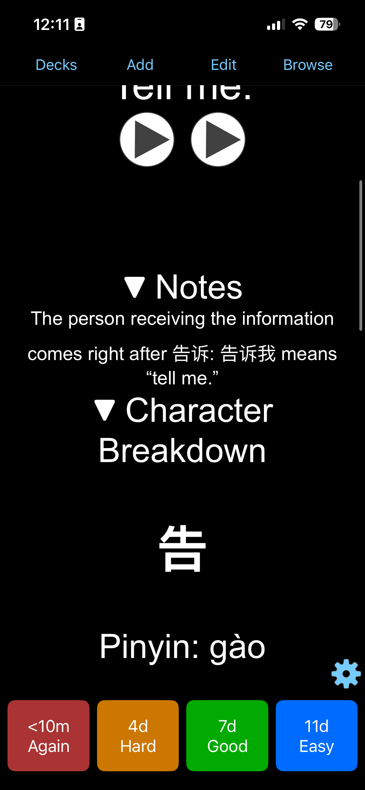

# Mandarin Flashcard Generator
Builds Mandarin flashcards for Anki with AI generated i+1 example sentences, pronunciations, notes, and character breakdowns.

## Sample Output

| Rank | Word | Pronunciation | Meaning | Sentence | Sentence Meaning | Notes |
|------|------|----------------|---------|----------|-------------------|-------|
| 5 | 了 | le | completed-action marker; change-of-state marker | 猫吃了苹果。 | The cat ate the apple. | After a verb, 了 marks a completed action. At the end of a sentence, it can mark a new situation: 他来了 "he has arrived." |
| 6 | 不 | bù | not | 猫不吃苹果。 | Cats do not eat apples. | 不 usually negates present, habitual, or future actions. 没 is generally used for past actions or for not having something. |
| 2 | 我 | wǒ | I; me | 我是中国人。 | I am Chinese. | — |

Ruby and character breakdowns have been removed to make the table for readability

## Why I Made This
After deciding to study Mandarin Chinese, I noticed that there weren’t any Anki
decks or data sets that contained everything I wanted out of vocabulary flashcards.
Namely: a deck ordered based strictly on a frequency list rather than the HSK, 
example sentences according to Krashen’s i+1 principle, notes flagging the nuances
of the harder-to-translate words, pronunciation guides, and a breakdown of the
characters making up a word. Because of this, I decided to make my own deck, 
based on a frequency list, and LLM generated i+1 example sentences.

## Features
  - The program takes in a precompiled frequency list of Mandarin words,
and generates a .CSV file that can be imported into Anki containing:
  - LLM generated translation, example sentences, and notes
  - Automatically generated pinyin for Chinese characters with pypinyin library
  - Character breakdowns from the Makemeahanzi dataset
  - Pregenerated .APKG file with all previously mentioned fields, card formatting, and audio for individual words and sentences (generated with HyperTTS)

## Technical approach
  - Extract data from frequency list with parse_cards.py, and giving each word a
rank, and pronunciation with pypinyin, and saving the result to cards.csv
  - Batch cards to make each group of cards asynchronously, speeding up the process.
  - Generate the prompt with custom instructions for each batch, and a strict
JSON schema to ensure consistent output
  - The prompt also contains a list of common, concrete words outside 
of the dataset it can use to create the earlier sentences.
  - Generate the AI fields each batch asynchronously
  - Extract the data from each batch into a pandas data frame
  - After all AI fields have been generated, it moves onto synchronously 
generating deterministic fields
  - Generates ruby pinyin fields for the generated notes, example sentences,
 and target word using pypinyin
  - Adds character breakdowns from the makemeahanzi dictionary with html formatting
  - Saves the pandas dataframe to “Output Data/Final Output.csv”
  - Used HyperTTS add-on to add audio to the pregenerated deck

## Challenges & What I Learned
  - Dataset issues: I started the project using the Wiktionary Mandarin Frequency List.
This frequency list was chosen due to having a pronunciation for each 
word. I initially assumed that the dataset having one pronunciation per
word meant that heteronyms would have multiple entities, one per each 
pronunciation. While generating test batches however, I realized that 
wasn’t the case, and that each heteronym was only given one slot in the 
dataset, with its other pronunciations completely ignored. Because of this, I 
switched the SUBTLEX-CH dataset due to the frequency ordering being higher
quality, and based on more conversational data over literary data. I ended up 
generating the pronunciations for each word with pypinyin. This
experience taught me to be more mindful when choosing datasets, since
had I chosen the SUBTLEX-CH dataset from the start, I would not have wasted
time creating architecture to extract the low quality data.

## Run It Yourself
  - Clone the repository
  - Install the dependencies (pip install pandas openai genanki pypinyin)
  - Have OpenAI API key as an environment variable
  - Replace raw_frequency_list.csv with a different frequency list (optional)
  - Edit config.py  to preferred settings (optional)
  - Edit “start” and “amount” variables in main.py to select how many cards to generate fields for (optional)
  - Run main.py

## Data Format
  - The input frequency list needs to be a CSV named “raw_frequency_list.csv”
  - The program outputs a CSV file named “Final Output.csv”,with the data, and can be imported directly into Anki

## Get the Prebuilt Deck
 -  Download the pregenerated .APKG file under “Pregenerated Outputs/Jordan’s Mandarin Vocab.apkg”
 -  If the english to mandarin template is not showing up, select all cards, and select reposition with the defult settings

## Tech Stack
 hyperTTS, Genanki, pandas, pypinyin, Python

## Known Limitations/Tradeoffs
  - LLM Accuracy concerns: As with any LLM generated content, there will unavoidably be hallucinations. While LLMs are fairly good at natural sentence generation, and translation, the notes may contain misinformation. To mitigate this, I used a higher end model with higher reasoning (GPT-5.6 Terra, using medium reasoning).  I moved forward with the project under the assumption that the notes would be there to FLAG nuances, and the user will do more research, and correct the occasional misinformation as they study the language.

  - Character Breakdowns: I initially was going to generate the character breakdowns with AI, but decided against it, wanting to avoid more potential hallucinations. I ended up going with the Makemeahanzi data set to generate the character breakdowns. While this likely improved the accuracy, it came with its own set of issues. Mainly, the makemeahanzi data set was “incomplete”. For example it was missing the “meaning” for many of the characters.

  - Checking: I do not speak fluent Mandarin, and cannot confirm the accuracy of the output, specifically the notes. While I did learn as much as I could during this process, and checked over what I could, tweaking the model output, I cannot guarantee its accuracy for the full deck on ~4,000 cards.

## What's Next
  - Replace AI generated notes with a more reliable data set
  - Use a better data set for the character breakdown
  - Find native speakers to look for flaws and verify the decks accuracy
  - Recreate as an Anki add-on that generates i+1 sentences for all languages

